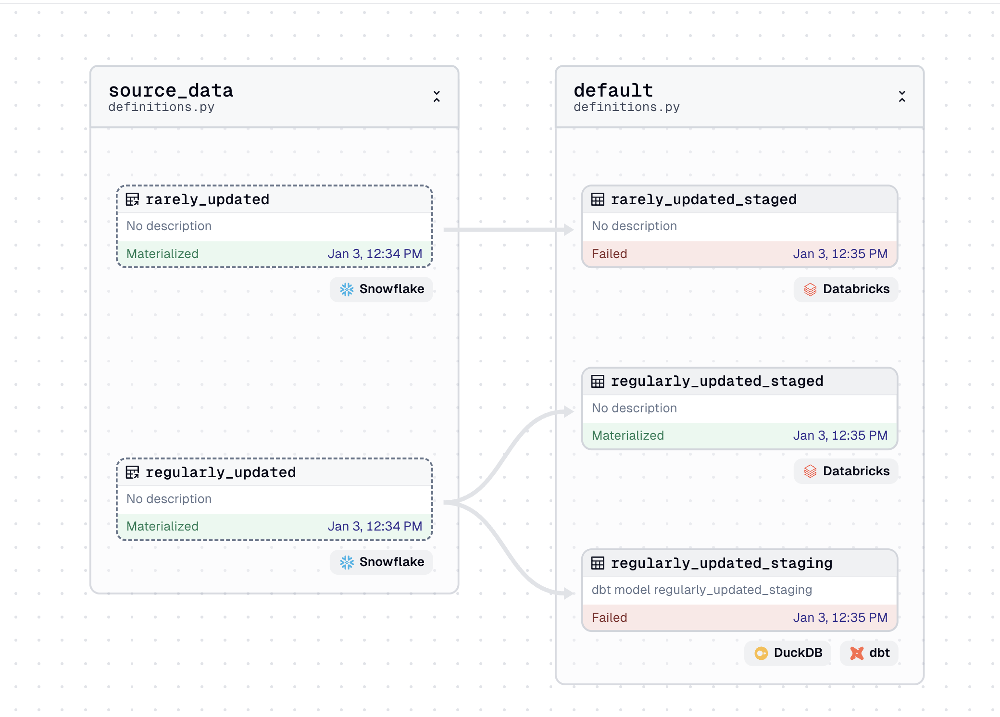

 
This example dagster project shows a situation where you have:

1. Tables in a warehouse that are created by some external process. These are modelled as external assets (created with an asset factory).

2. Downstream tables managed by Dagster. These tables are modelled as dagster assets which can be direct Python code or via an integration like dagster-dbt.

A sensor tracks the external assets and returns materialization metadata. The downstream assets are then launched via automation conditions.

## Usage

1. Create the appropriate python environment
2. Run `dagster dev -f definitions.py` 
3. Open dagster, click "Automations", and turn on the 3 automations

The `watch_external` sensor tracks updates to the externally managed tables. Those tables will occasionally be updated by the scheduled job `fake_external_system_updates`. When updates are found, the external assets will be materialized, which can be seen on by navigating to "Assets" and "View global asset lineage". The automation sensor will then launch runs for the downstream assets. 

